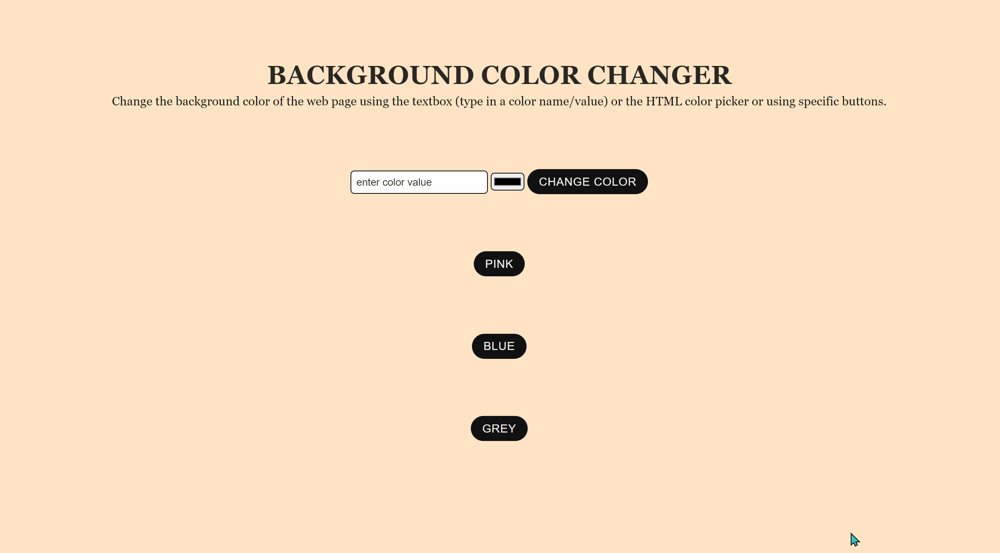

# MultiColor
Change the background color of the web page using the textbox (type in a color name/value) or the HTML color picker or using specific buttons.

### To view
Link to project: https://NeirouzJbira.github.io/MultiColor/

### Demo

### Technologies 
- HTML5
- CSS3
- JavaScript